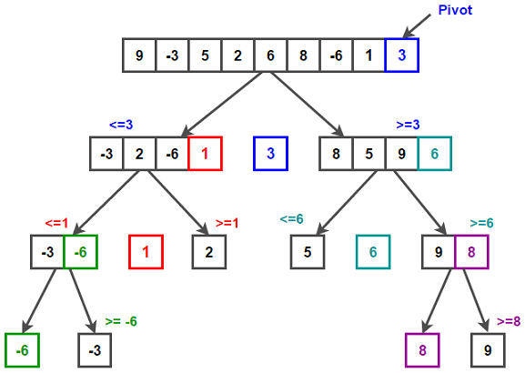

# Divide  & Conquer

<!-- TABLE OF CONTENTS -->
## Table of Contents
- [about](#about)
- [구성 요소](#구성-요소)
- [특성](#특성)
- [장점](#장점)
- [Example 1 : 수열의 빠른 합](#Example_1)
- [Example 2 : 행렬의 거듭제곱](#Example_2)
- [병합 정렬(Merge sort)](#병합-정렬_Merge-sort)
- [퀵 정렬(Quick sort)](#퀵-정렬_Quick-sort)

<!-- about -->
## about
- 가장 유명한 알고리즘 디자인 패러다임

- 분할 정복 패러다임을 차용한 알고리즘들은 주어진 문제를 둘 이상의 부분 문제로 나눈 뒤 각 문제에 대한 답을 재귀 호출을 이용해 계산, 각 부분 문제의 답으로부터 전체 문제의 답을 계산

- 일반적인 재귀 호출과 다른 점은 문제를 한 조각과 나머니 전체로 나누는 대신 거의 같은 크기의 부분 문제로 나눔

- 일반 재귀 호출은 항상 문제를 한 조각과 나머지로 쪼개는 방식, 분할정복법은 항상 문제를 절반씩으로 나누는 분할 정복 알고리즘

<p align="center">
    
	<p align="center"> 출처 : https://kugistory.net/7 </p>
</p>


<!-- 구성 요소 -->
## 구성 요소
- 문제를 더 작은 문제로 분할(Divide)

- 각 문제에 대해 구한 답을 원래 문제에 대한 답으로 병합(Merge)

- 더이상 답을 분할하지 않고 곧장 풀 수 있는 매우 작은 문제(base case)


<!-- 특성 -->
## 특성
- 문제를 둘 이상의 부분 분제로 나누는 자연스러운 방법이 있어야 함

- 부분 문제의 답을 조합해 원래 문제의 답을 계산하는 효율적인 방법이 있어야 함


<!-- 장점 -->
## 장점
- 같은 작업을 더 빠르게 처리


<!-- Example 1 -->
## Example_1
### 수열의 빠른 합
- 1부터 n까지의 합을 n개의 조각으로 나눈 뒤, 이들을 반으로 잘라 n/2개 조각들로 만들어진 부분 문제 두 개를 만듦

- 1 ~ n/2 과 n/2+1 ~ n로 나눌 수 있음

- 첫 번째 부분은 fastSum(n/2)로 나타낼 수 있지만, 두 번째 문제는 나타낼 수 있는 방법을 생각해야 함

- (n/2+1) + ... + n
	- (n/2+1) + (n/2+2) + ... (n/2+n/2)  `// 결국, n/2 + n/2 + n/2 + .... 가 n/2번 반복되고, 1+ 2+ 3+ ... + n/2가 남게 됨</span>`
	- = n/2 x n/2 + (1 +2 + 3 + ... + n/2)  `// n/2가 n/2번 반복, 1 ~ n/2 까지의 합`
	- = n/2 x n/2 + fastSum(n/2)  `// 공통된 항 n/2를 따로 빼내면 fastSum(n/2)가 나타남`

- fastSum(n)  = 2 x fastSum(n/2) + n<sup>2/4</sup> (n은 짝수)
	- // fastSum(n/2) + n/2 * n/2 + fastSum(n/2)
    
- 결론
	- n/2 까지의 합은 : fastSum(n/2)
	- n/2+1 ~ n 까지의 합은 : n/2 x n/2 + fastSum(n/2)

- 그러므로 
	- fastSum(n/2) + fastSum(n/2) + n/2 x n/2
	- = 2 x fastSum(n/2) + n<sup>2/4</sup>

```java
public class C7_1 {
    public static int fastSum(int num) {
        if(num == 1) return 1;
        // 홀수일 경우, 짝수인 n-1번째 까지의 합을 재귀 호출로 구한 후 마지막에 num을 더해줌
        if(num % 2 == 1) return fastSum(num-1) + num;
        // 짝수일 경우 더 작은 부분으로 분할하여 재귀 호출
        return 2*fastSum(num/2) + (num/2)*(num/2);
    }
    public static void main(String[] args) {
        System.out.println(fastSum(10));
    }
}
```


<!-- Example 2 -->
## Example_2
### 행렬의 거듭제곱
- n x n 크기의 행렬 A가 주어질 때, A의 거듭 제곱(power) A<sup>m</sup>은 A를 연속해서 m번 곱한 것

- m이 커질수록 시간이 오래 걸리는 작업

- 분할 정복을 적용한다면 A<sup>m</sup> = A<sup>m/2</sup> X A<sup>m/2</sup>

```java
class SquareMatrix {
    // 정방행렬을 표현하는 SquareMatrix class
}
 
public class C7_2 {
    public static SquareMatrix identity(int n) {
        // n * n 크기의 항등 행렬을 반환하는 함수
    }
    
    public static SquareMatrix pow(SquareMatrix S, int m) {
        if(m == 0) return new SquareMatrix(identity(S.size());
        if(m%2 > 0) return pow(S, m-1) * S;  // 거듭제곱이 홀수일 경우 m-1 
        SquareMatrix half = pow(S, m/2);  // 거듭제곱이 짝수일 경우 절반으로 분할
        // Am = (A(m/2)) * (A(m/2))
        return half * half;  // 최종으로 2분할된 행렬을 제곱
    }
    
    public static void main(String[] args) {
        SquareMatrix matrx = new SquareMatrix(5);
        pow(matrx, 10);
    }
}
```
 
- 같은 문제라도 어떻게 분할하느냐에 따라 시간 복잡도 차이가 커지게 됨 (계속 분할할지, 짝수번째만 분할할지)

- 계속해서 절반으로 나누는 알고리즘이 큰 효율 저하를 불러 오는 이유는 여러번 중복되어 계산이 되면서 시간을 소모하는 부분이 문제


- 주어신 수열을 크기 순서대로 정렬하는 문제는 전산학에서 가장 유명한 문제 중 하나

- 정렬 문제를 해결하는 수많은 알고리즘 중 가장 널리 쓰이는 알고리즘들이 병합 정렬, 퀵 정렬

- 같은 문제를 해결하는 알고리즘이라도 어떤 식으로 분할하느냐에 따라 다른 알고리즘이 될 수 있음


## 병합 정렬_Merge sort
#### (분할 정복 패러다임 기반으로 만들어진 정렬 알고리즘 1)

- 각 수열의 크기가 1이 될때까지 절반으로 쪼개 나간 뒤, 정렬된 부분 배열들을 합쳐 나아감

- 단순하고 효율적인 방법

- 병합 정렬 알고리즘은

   1. 주어진 수열을 가운데에서 쪼개 비슷한 크기의 수열 두개로 만든 뒤 이들을 재귀호출을 이용해 각각 정렬(계속 절반으로 분할)

   2. 정렬된 배열을 하나로 합침으로써 정렬된 전체 수열을 얻음

- 시간 복잡도

  - 각 단계마다 반으로 나눈 부분 문제를 재귀 호출을 이용해 해결한 뒤, 이 결과 수열을 합쳐 전체 문제의 답을 계산

  - 정렬된 두 부분 수열을 합치는데 두 수열의 길이만큼 반복문을 수행해야 하므로, 수행 시간은 병합 과정에 의해 지배

  - 필요한 총 시간은 단계 수 x n = O(nlogn)

<p align="center">
    
	<p align="center"> 출처 : https://www.techiedelight.com/merge-sort/ </p>
</p>


## 퀵 정렬_Quick sort
#### (분할 정복 패러다임 기반으로 만들어진 정렬 알고리즘 2)

- 각 부분 수열의 맨 처음(또는 맨 끝)에 있는 수를 기준으로 삼고, 이들보다 작은 수를 왼쪽, 큰 수를 오른쪽으로 가도록 분해

- 퀵 정렬 알고리즘은

  1. 배열을 단순하게 가운데에서 쪼개는 대신, 병합 과정이 필요 없도록 한쪽의 배열에 포함된 수가 다른 쪽 배열의 수보다 항상 작도록 배열을 분할 -> 파티션(partition)이라고 부르는 단계 도입

     * 파이션은 배열에 있는 수 중 임의의 수 '기준 수(pivot)'를 지정한 후 기준보다 작거나 같은 숫자를 왼쪽, 더 큰 숫자를 오른쪽으로 보내는 과정

- 시간 복잡도

  - 주어진 문제를 두 개의 부분 문제로 나누는 파티션 과정, 파티션에는 주어진 수열의 길이에 비례하는 시간이 걸림

  - 분할된 두 부분 문제가 비슷한 크기로 나눠진다는 보장이 없으므로 최악의 경우 O(n2)의 시간 복잡도가 나올 수 있음

  - 대부분 퀵 정렬 구현은 가능한 절반에 가까운 분할을 얻기 위해 좋은 기준을 뽑는 다양한 방법들을 사용

  - 평균적으로 부분 문제가 절반에 가깝게 나눠질 경우는 O(nlon)으로 병합 정렬과 같음

<p align="center">
    
	<p align="center"> 출처 : https://www.techiedelight.com/quicksort/ </p>
</p>


